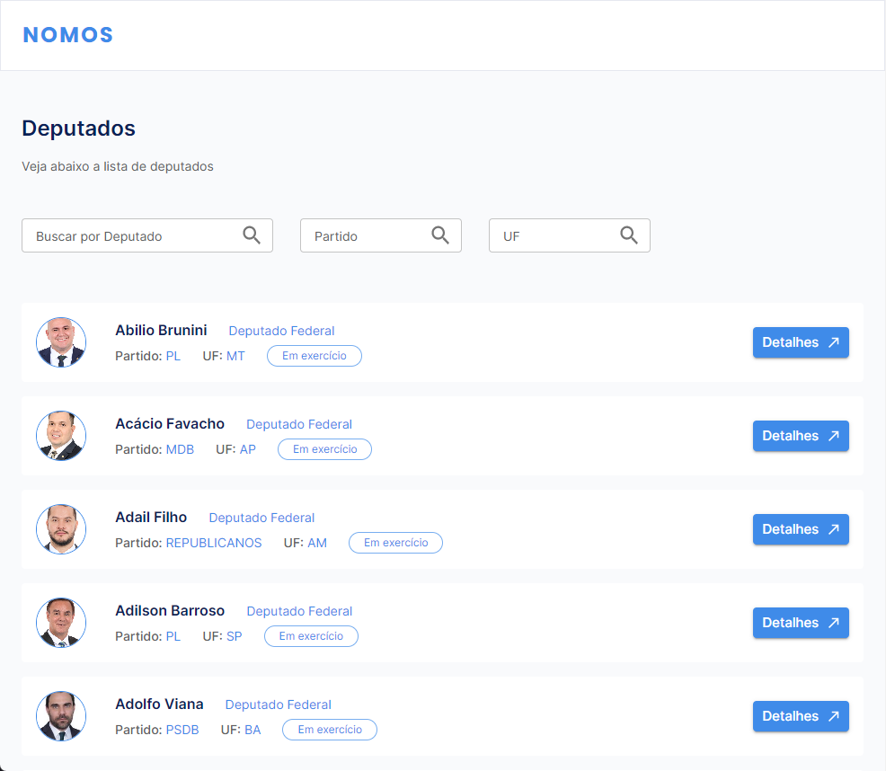
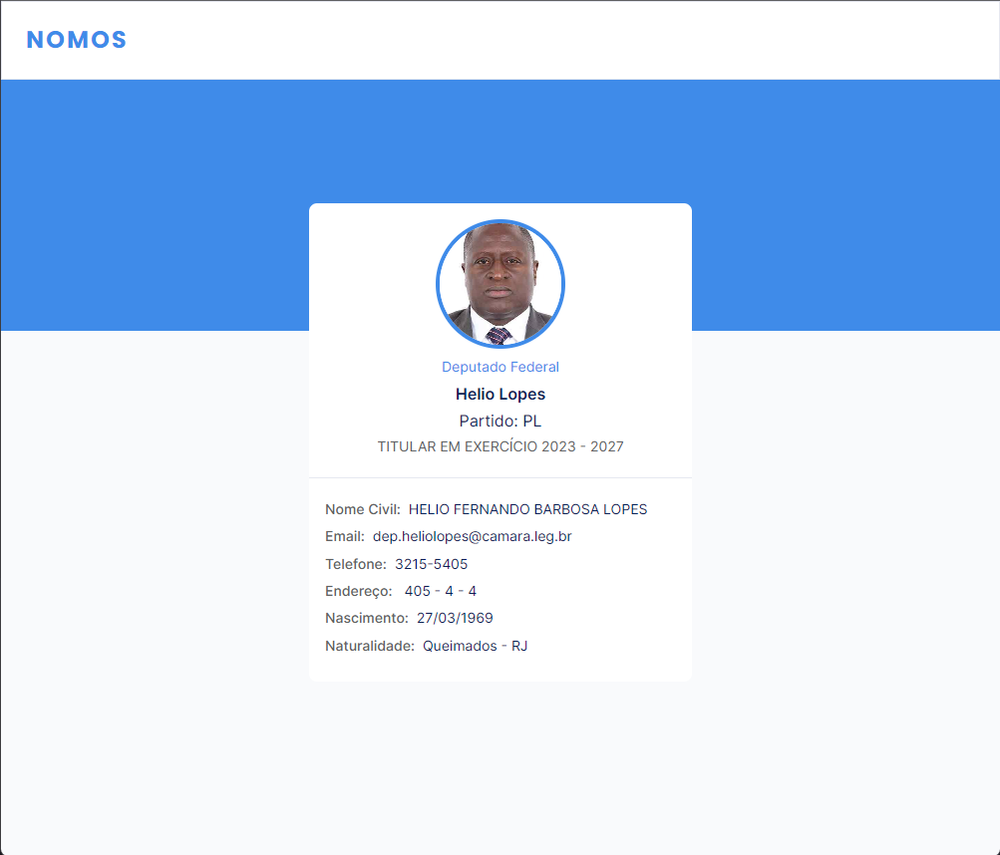
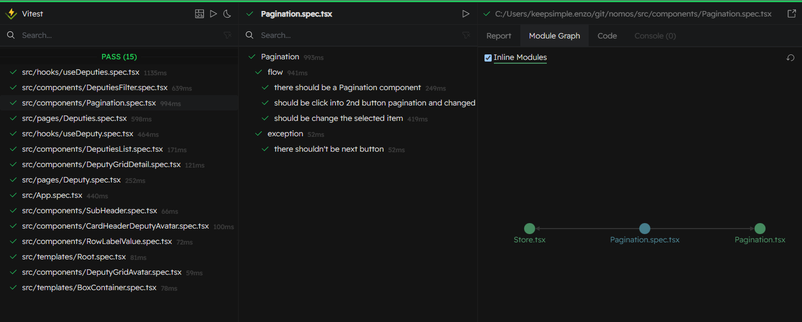
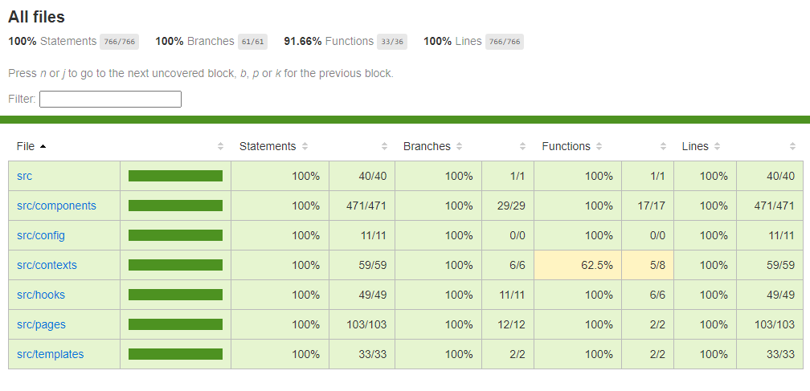
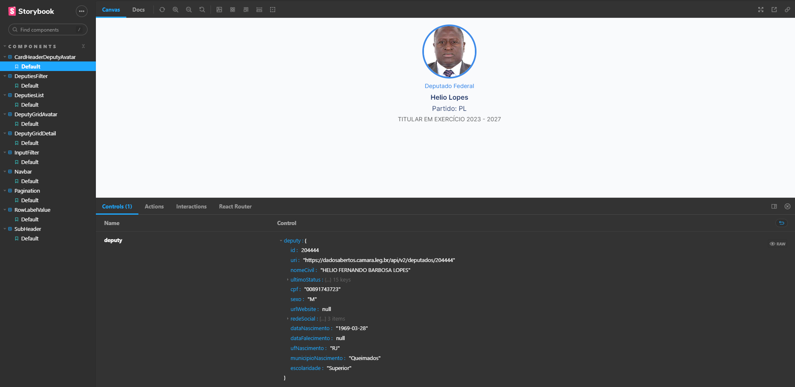
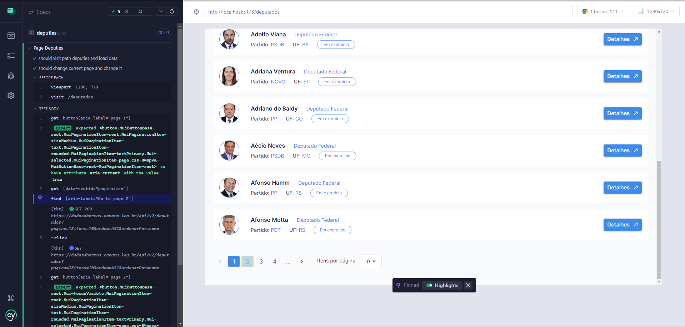

# 🚀 Desafio Frontend

Desenvolver as telas ao lado seguindo as melhores práticas de desenvolvimento de software. Avaliaremos como você trabalha a construção dos componentes visando reutilização e performance, extrando o máximo do React.
# 🧠 Contexto

- [x] Catálogo de deputados com paginação
- [x] Filtragem deputados por nome, partido e uf
- [x] Quantidade de deputados por pagina
- [x] Página detalhada do deputado

## 🤖 Rodando a aplicação

- Application with [Vite](https://vitejs.dev/):
```bach
npm install
```
```bach
npm run dev
```


- Test with [Vitest](https://github.com/vitest-dev/vitest):
```bach
npm run test
```


- Coverage with [Vitest](https://github.com/vitest-dev/vitest):
```bach
npm run coverage
```


- [Storybook](https://storybook.js.org/):
```bach
$env:NODE_OPTIONS="--openssl-legacy-provider"
```
you need to run the bash above if you had using node version > 19 at powershell

```bach
npm run storybook
```


- e2e with [Cypress](https://www.cypress.io/):
```bach
npm run cypress
```


## 📋 Instruções

1. Código deve estar em Typescript
2. Teste unitário (Jest) e Teste E2E (Cypress)
3. Utilizar o use-context-selector para lidar com as properties
4. Utilizar o Storybook para documentar os componentes
5. Utilizar ESlint para análise de código estático
6. Utilizar o TanStackQuery para as chamadas de API
7. Seguir o styleguide a baixo priorizando a criação de temas no MUI
8. Seguir o protótipo do [Figma](https://www.figma.com/file/2niNjUpbG4I522HzeyZsnA/Teste-Nomos?node-id=1-2&t=Ss5wEaKV9ID942H2-0)

## 📰 API

- https://dadosabertos.camara.leg.br/swagger/api.html
- Listagem de deputados --> /deputados
- Dados do deputado --> /deputados/:id

## 📖 Referências

- https://blog.openreplay.com/react-architecture-patterns-for-your-projects
- https://andela.com/insights/structuring-your-react-application-atomic-design-principles/
- https://www.npmjs.com/package/use-context-selector
- https://tanstack.com/query/v4/docs/react/overview
- https://mui.com/material-ui/customization/theming/

---
Made with ❤️ by [Enzo Glauber](https://www.linkedin.com/in/enzo-glauber/)
